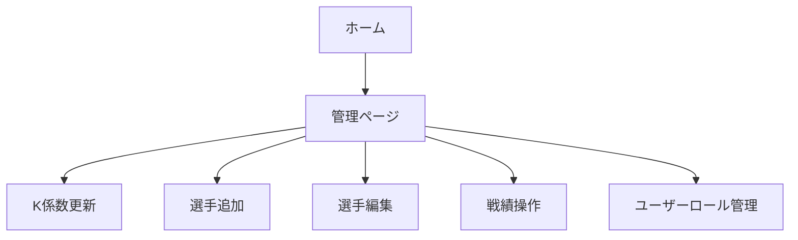

# 管理者ユーザー向け取り扱い説明書

## 目的

管理者がシステムを運用するために必要な管理操作を実行できることを説明します。

## 役割とできること

- ゲスト・選手ユーザーの閲覧操作
- 戦績登録
- 選手の追加・編集
- K 係数の更新
- 最新戦績のロールバック
- ランキングのリセット
- ユーザーロールの管理

## 利用手順

1. 管理者として Discord ログインする
2. 管理ページを開き、K 係数や選手情報を確認する
3. 「選手追加」で新しい選手を登録する
4. 「選手一覧 / 編集」で既存選手の情報を更新する
5. 必要に応じて「最新戦績をロールバック」または「ランクリセット」を実行する
6. ユーザーロール一覧から他ユーザーのロールを変更する

## 画面遷移

## 正常系の確認ポイント

- 管理ページにアクセスできる
- K 係数を変更して保存できる
- 新規選手を追加できる
- 既存選手の編集が保存できる
- ロールバック・ランキングリセットが実行できる
- ユーザーロールを変更できる
