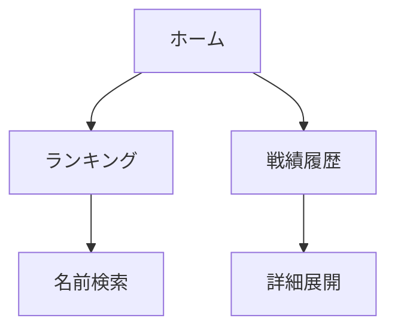

# ゲストユーザー向け取り扱い説明書

## 目的

ゲストユーザーがランキングと戦績履歴を閲覧し、アプリの基本的な価値を確認できるようにするための手順です。

## 役割とできること

- ランキングページの閲覧
- 戦績履歴ページの閲覧
- ホームページで現在の権限の確認

## 利用手順

1. アプリのトップページを開く
2. ホーム画面で「ゲストとして閲覧できます」という表示を確認する
3. ランキングページへ移動し、名前検索で選手を絞り込む
4. 戦績履歴ページへ移動し、各試合の詳細を展開して確認する

## 画面遷移

## 正常系の確認ポイント

- ホーム画面でゲスト権限が表示される
- ランキングが一覧表示される
- 検索条件に一致する選手だけが表示される
- 戦績履歴の各項目を展開すると詳細が見える
