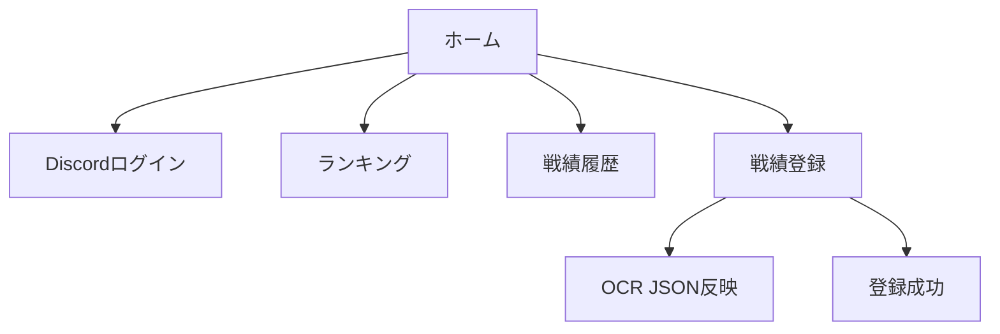

# 選手ユーザー向け取り扱い説明書

## 目的

選手ユーザーが Discord ログインを行い、戦績登録を含む基本操作を実行できることを説明します。

## 役割とできること

- ゲストユーザーと同じ閲覧操作
- Discord ログイン
- 戦績登録

## 利用手順

1. ホーム画面で「Discordでログイン」を実行する
2. ログイン後にロールが「選手」または「管理者」として表示されることを確認する
3. ランキングおよび戦績履歴を確認する
4. 戦績登録ページへ移動し、勝者・敗者の6人を選択する
5. MATCH ID、MAP、日時を入力し、必要に応じて OCR JSON を貼り付ける
6. 「戦績を登録」を押して成功メッセージを確認する

## 画面遷移

## 正常系の確認ポイント

- ログイン後に戦績登録ボタンが利用可能になる
- 6人の選手を選択すると登録できる
- OCR JSON を入力すると入力項目が自動反映される
- 登録成功時にメッセージとお祝い表示が出る
